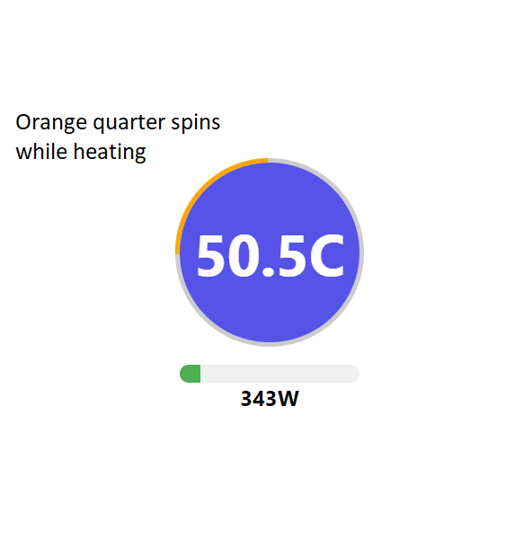

# AC-ELWA-Landingpage

Simple React based WebApp as replacement for that stupid crappy HTML File they offer.

## How to run

This landingpage needs to be hosted on any Server you may want. You just have to change the ELWAs IP adress accordingly (src/API/API.js). I built it using the commented buildx command (Dockerfile) and host it in a simple docker environment on my homeserver.

