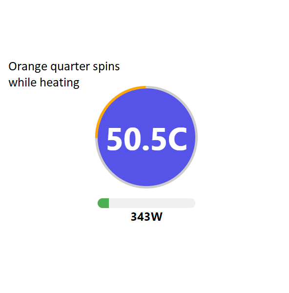

This Repository has been moved to codeberg https://codeberg.org/crstst/ac-elwa-landingpage

# AC-ELWA-Landingpage

Simple React based PWA to run on a(ny) Mobile Phone either than that stupid crappy HTML File they offer.



## How to build

This landingpage can be hosted on any Server you may want. You just have to change the ELWAs IP adress accordingly (src/API/API.js) and build it using the commented buildx command (Dockerfile).

## How to run

### Starting the fake backend

To start the fake backend go to the repositories directory, open a console and install all neccessary requirements using `npm install`
After that you can start fake backend using `npm run fake:server`
Output should look like this:

```bash
> ac-elwa-landingpage@0.1.0 fake:server
> node fake-server.js

Fake backend läuft auf http://0.0.0.0:4000

```

### Starting the frontend

Now, open another terminal in the repositories folder and start frontend using `npm start`
